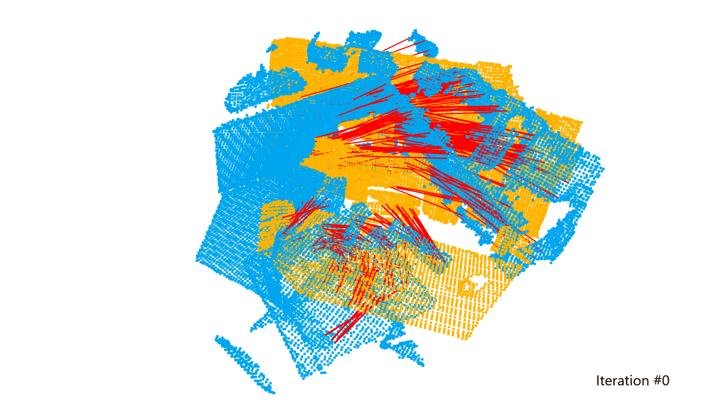

# FracGM

[](https://opensource.org/licenses/BSD-3-Clause)
[](https://github.com/rust-lang/rustfmt)
[](https://github.com/astral-sh/ruff)
[](https://releases.llvm.org/18.1.8/tools/clang/tools/extra/docs/ReleaseNotes.html)

Official implementation of "FracGM: A Fast Fractional Programming Technique for
Geman-McClure Robust Estimator." This work is accpeted for publication by IEEE
Robotics and Automation Letters (RA-L). This library is written in **Rust** and
we support **Rust**, **C++**, and **Python** interfaces.

|  |  |
| ---------------------------------------- | ------------------------------------------ |

**About FracGM**

FracGM is a fast and accurate algorithm for Geman-McClure robust estimation,
which leverages fractional programming techniques. It exhibits fast convergence
rate and well outlier rejection capability. In addition, the global optimality
of the proposed solver can be guaranteed under given conditions.

For more, please refer to our paper:

- [Bang-Shien Chen](https://dgbshien.com/), [Yu-Kai Lin](https://github.com/StephLin), [Jian-Yu Chen](https://github.com/Jian-yu-chen), [Chih-Wei Huang](https://sites.google.com/ce.ncu.edu.tw/cwhuang/), [Jann-Long Chern](https://math.ntnu.edu.tw/~chern/), [Ching-Cherng Sun](https://www.dop.ncu.edu.tw/en/Faculty/faculty_more/9), **FracGM: A Fast Fractional Programming Technique for Geman-McClure Robust Estimator**. _IEEE Robotics and Automation Letters (RA-L)_, 2024. ([paper](https://doi.org/10.1109/lra.2024.3495372)) ([preprint](https://arxiv.org/pdf/2409.13978)) ([code](https://github.com/StephLin/FracGM))

**Table of Contents**

- [FracGM](#fracgm)
  - [:gear: Setup](#gear-setup)
    - [Prerequisites](#prerequisites)
    - [Building FracGM](#building-fracgm)
  - [:seedling: Example Usages](#seedling-example-usages)
  - [:coffee: Supplementary Materials](#coffee-supplementary-materials)
  - [:gift: Acknowledgement](#gift-acknowledgement)

## :gear: Setup

The following setup is tested in Ubuntu 22.04.

### Prerequisites

```bash
# Rust
curl https://sh.rustup.rs -sSf | sh
# Use the following command to load the Rust environment in the same shell:
# . "$HOME/.cargo/env"            # For sh/bash/zsh/ash/dash/pdksh
# source "$HOME/.cargo/env.fish"  # For fish

# OpenBLAS (for ndarray-linalg)
sudo apt update
sudo apt install -y libopenblas-dev pkg-config libssl-dev cmake

# C++ (for maximum clique inlier selection)
sudo apt install -y g++

# (Optional) Setup the C++ wrapper
sudo apt install -y g++
python3 -m pip install meson ninja

# (Optional) Setup the Python wrapper
# python3 -m pip install virtualenv
# python3 -m virtualenv venv
# source venv/bin/activate
sudo apt install -y python3-pip python3-dev
python3 -m pip install numpy "maturin[patchelf]" rich
```

### Building FracGM

```bash
git clone --recurse-submodules -j8 https://github.com/StephLin/FracGM.git
cd FracGM

# If you do not clone FracGM with --recurse-submodules option,
# you may need to run the following command.
git submodule update --init

# 🦀 Build FracGM with Native Rust support
cargo build --release --package fracgm

# 🥐 Build FracGM with C++ wrapper
python3 scripts/build_fracgm_cxx_library.py
# header files: ./fracgm-cxx/include
# library file: ./target/release/libfracgm_cxx.so

# 🐍 Build and install FracGM with Python wrapper
# (Notice: You should check the real path to the wheel file
#  e.g., ./target/wheels/fracgm-0.1.0-cp310-cp310-manylinux_2_34_x86_64.whl)
python3 scripts/build_fracgm_python_package.py
python3 -m pip install $(ls ./target/wheels/*.whl) --force-reinstall
```

## :seedling: Example Usages

- [:crab: Rust](examples/rust)
- [:croissant: C++](examples/cpp)
- [:snake: Python](examples/python)

## :coffee: Supplementary Materials

- [:page_facing_up: Appendix A.](appendix/appx_A) A simple example of FracGM with global optimal guarantees
- [:page_facing_up: Appendix B.](appendix/appx_B) Tightness of linear relaxation
- [:page_facing_up: Appendix C.](appendix/appx_C) Sensitivity of initial guess

## :gift: Acknowledgement

The feature of maximum clique inlier selection (MCIS) refers to [TEASER++'s implementation](https://github.com/MIT-SPARK/TEASER-plusplus), which is under the MIT license.
We modify the implementation to bundle with the FracGM Rust interface.
