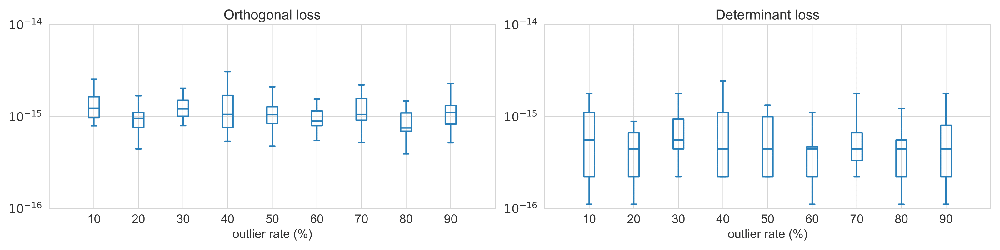
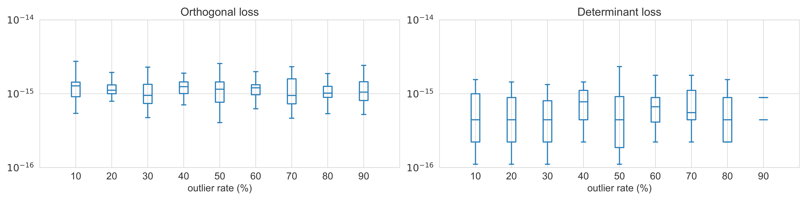

### Tightness of linear relaxation

For FracGM-based rotation and registration solvers, the relaxation is tight if solutions of the relaxed program in $\mathbb{R}^{3\times 3}$ and $\mathbb{R}^{4\times 4}$ are also within $\text{SO}(3)$ and $\text{SE}(3)$ respectively.
In practice, we can evaluate the tightness of the relaxation by checking the orthogonality and determinant of a solution given by the relaxed program.
Taking our rotation estimation tasks on synthetic dataset for example, we quantify the tightness by an orthogonal loss $\mathcal{L}_o$ and a determinant loss $\mathcal{L}_d$ defined as follows:

$$
\begin{aligned}
\mathcal{L}_o&=\|(\mathbf{R}^\prime)^\top\mathbf{R}^\prime - \mathbf{I}_3\|_F\\
\mathcal{L}_d&=|\text{det}(\mathbf{R}^\prime)-1|
\end{aligned}
$$

where $\|\cdot\|_F$ is the Frobenius norm, and we verify the orthogonality and determinant of the rotation part of solutions $\mathbf{R}^\prime$ before SVD projection:

Similarly, we verify the rotation part of solutions for registration tasks on synthetic dataset as follows:

Above evaluations reveal that FracGM-based rotation and registration solvers are empirically tight mostly in our experiments.
We conjecture that the solution tends to approach the original solution space with sufficient number of measurements, in which a similar discussion can be found in [[34](#ref1), Section 2.1].
Though, unfortunately we are unable to clarify the conditions to theoretically guarantee tightness and global optimality for both FracGM-based rotation and registration solvers.
Besides the issue of tightness, the global optimality of the relaxed problem is also subject to the conditions specified in Proposition 3, which is difficult to verify as it depends on the input data and requires discussions on various situations.
We appreciate the reviewer for raising this important issue, which we also consider to be one of the difficulties but crucial research problems in our future work.

<a id="ref1">[34]</a> 
C. Olsson and A. P. Eriksson, “Solving quadratically constrained geometrical problems using lagrangian duality,” in ICPR. IEEE Computer Society, 2008, pp. 1–5.