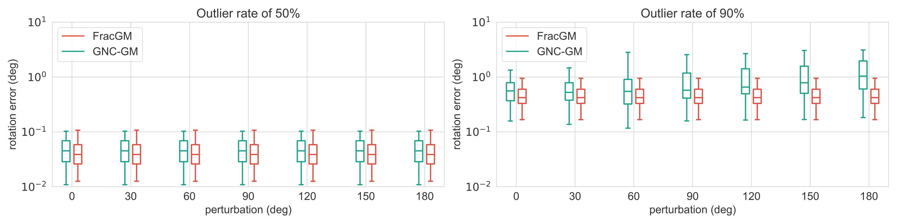

# :page_facing_up: Sensitivity of initial guess

If a FracGM method satisfies Proposition 3, then it is a global solver, and it should not be sensitive to initial guesses.
We do not think the FracGM-based rotation and registration solvers are insensitive to initial guesses for any kinds of input data, due to the fact that we are unable to verify Proposition 3 at the moment. Nevertheless, empirical studies on experiments show that our FracGM-based solvers are mostly insensitive to initial guesses.

We compare our FracGM-based rotation solver with the other Geman-McClure solver, GNC-GM [[17]](#ref1), on the synthetic dataset. We construct various initial guesses by adding some degree of perturbation to the ground truth rotation matrix. With an outlier rate of 50\%, both FracGM and GNC-GM seems insensitive to initial guesses. However, in extreme cases where the outlier rate is 90\%, GNC-GM produces different solutions due to different initial guesses, while FracGM remains insensitive to initial guesses.

<a id="ref1">[17]</a> 
H. Yang, P. Antonante, V. Tzoumas, and L. Carlone, “Graduated nonconvexity for robust spatial perception: From non-minimal solvers to global outlier rejection,” IEEE Robotics Autom. Lett., vol. 5, no. 2, pp. 1127–1134, 2020.